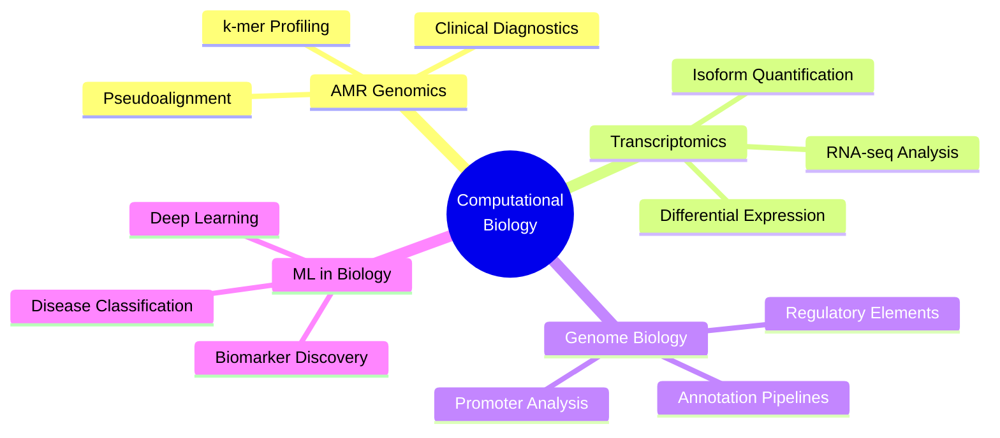

<div align="center">

<!-- Dynamic Header -->


<!-- Typing Animation -->
[](https://git.io/typing-svg)

<!-- Social Badges -->
[](https://linkedin.com/in/ankushrouth)
[](mailto:ankushrouth10@gmail.com)
[](#)
[](#)

<br/>

> *"Decoding the genome, one k-mer at a time."*

</div>

---

## 🧬 About Me

```python
researcher = {
    "name"        : "Ankush Kumar Rout",
    "degree"      : "M.Sc. Life Science — NIT Rourkela (2024–2026)",
    "location"    : "Rourkela, Odisha, India",
    "focus"       : ["Genomics", "Transcriptomics", "AMR Bioinformatics",
                     "Genome Annotation", "Computational Biology"],
    "tools"       : ["Python", "Bash", "R", "Linux HPC", "Galaxy",
                     "BWA", "STAR", "Salmon", "GATK", "QIIME2"],
    "interests"   : ["RNA-seq", "Pseudoalignment", "k-mer Methods",
                     "Machine Learning in Biology", "Clinical Bioinformatics"],
    "aspiration"  : "PhD in Bioinformatics @ Harvard / MIT / Stanford / CSIR-CCMB",
    "contact"     : "ankushrouth10@gmail.com"
}
```

I am a computational biologist and bioinformatician with a strong foundation in **Next-Generation Sequencing (NGS) analysis**, **transcriptomics**, and **genome annotation**. My dissertation project, **AMR Analyser**, implements a pseudoalignment-based pipeline using k-mer compatibility mapping and Expectation-Maximization (EM) algorithms to detect and quantify antimicrobial resistance genes from RNA-seq data — a clinically translatable, computationally efficient approach to the global AMR crisis.

I have trained at two of India's premier research institutes — the **Supercomputing Facility for Bioinformatics & Computational Biology at IIT Delhi** and **Mechanica, IIT Madras** — where I developed production-grade bioinformatics pipelines and executed molecular docking simulations on HPC environments.

---

## 🏆 Achievements & Qualifications

<div align="center">

| 🏅 Examination | 🎯 Score / Rank | 📊 Percentile |
|:---|:---|:---|
| **IIT JAM (M.Sc. Life Science)** | AIR **174** / 10,584 | Top **~1.6%** |
| **GATE Biotechnology** | AIR **2350** / 21,513 | Top **~10.9%** |
| **IELTS** | Band Score **7.5** | C1 Proficient |
| **JGEEBILS** | Qualified | National Level |
| **NEET / JEE Mains / CAT** | Qualified | National Level |
| **All India CBSE Hockey (Clusters)** | **3rd Prize** | Captain of Team |

</div>

---

## 🔬 Research Experience

<details open>
<summary><b>🖥️ Summer Research Intern | IIT Delhi — Supercomputing Facility for Bioinformatics & Computational Biology (May–July 2025)</b></summary>

<br/>

> One of India's most prestigious computational biology environments, housing petascale HPC infrastructure for genome-scale analyses.

- Conducted an exhaustive **literature meta-analysis** evaluating structural and physicochemical bases driving **genomic element characterization**.
- Reproduced and optimized an **in-house genome annotation pipeline** covering end-to-end data collection, parsing, and multi-database integration.
- Engineered custom **Python and Bash scripts** for site-specific processing of eukaryotic **promoters, exon–intron junctions**, and **open reading frames (ORFs)**.

</details>

<details open>
<summary><b>🧪 Research Intern | IIT Madras — Mechanica (Feb–March 2025)</b></summary>

<br/>

> IIT Madras's interdisciplinary computational research group bridging molecular biology and systems engineering.

- Deployed **NGS data analysis workflows** using Galaxy and Linux-based HPC environments.
- Executed core **RNA-seq pipelines** including quality control (FastQC/Trimmomatic), read alignment (STAR/HISAT2), and transcript quantification (Salmon/featureCounts).
- Modeled targeted **molecular docking simulations** evaluating binding affinity and structural stability of the curcumin ligand against specific protein kinases using AutoDock/Vina.

</details>

---

## 📁 Featured Projects

### 🦠 AMR Analyser — Pseudoalignment-Based AMR Gene Detection from RNA-seq Data
> *Dissertation Project — Final Semester 2026 | NIT Rourkela*

```
┌─────────────────────────────────────────────────────────────────────┐
│  RNA-seq FASTQ  ──►  k-mer Index  ──►  Pseudoalignment  ──►  EM     │
│                       (AMR DB)        (Compatibility     Algorithm  │
│                                         Mapping)        ──► Counts  │
└─────────────────────────────────────────────────────────────────────┘
```

- **Architected** AMR Analyser — a high-throughput tool for rapid, **compatibility-based k-mer mapping** to detect antimicrobial resistance indicators directly from raw RNA-seq data.
- **Implemented Expectation-Maximization (EM) algorithms** for precise transcript-level abundance estimation — enabling multi-mapping read resolution without full alignment overhead.
- Achieved **drastically reduced computational time** vs. alignment-based tools (BWA/Bowtie2), making it viable for **real-time clinical diagnostics** and AMR surveillance.


---

### 🕐 Mammalian Circadian Rhythms — Molecular Mechanisms & Disease Implications
> *Research Project — Final Semester 2024 | NIT Rourkela*

- Dissected the **hierarchical architecture** of the mammalian suprachiasmatic nucleus (SCN) and its molecular feedback loops (CLOCK/BMAL1/PER/CRY axis).
- Analyzed **peripheral clock synchronization** mechanisms and downstream regulatory impacts on metabolic pathways and cell-cycle checkpoints.
- Correlated systemic circadian disruption with **metabolic syndrome, oncology variations, and psychiatric pathologies** to identify novel therapeutic targets.


---

## 🛠️ Technical Skills

<div align="center">

### 💻 Programming & Scripting


### 🧬 Bioinformatics Tools & Pipelines


### 🔬 Specialized Methods

| Domain | Skills |
|:---|:---|
| **NGS Analysis** | RNA-seq, Quality Control, Pseudoalignment, Variant Calling |
| **Genome Annotation** | ORF Detection, Promoter Mapping, Exon-Intron Processing |
| **k-mer Methods** | Compatibility-based mapping, Index construction, EM quantification |
| **Structural Biology** | Molecular Docking, Protein-Ligand Interaction, AutoDock Vina |
| **ML in Bioinformatics** | Feature Engineering, Classification, Biological Data Analysis |
| **HPC** | SLURM/PBS job scheduling, Parallel pipeline execution, IIT Delhi HPC |

</div>

---

## 📊 GitHub Stats

<div align="center">


[](https://git.io/streak-stats)

</div>

---

## 🎓 Education

```
📍 M.Sc. Life Science                            NIT Rourkela (2024–2026)
   National Institute of Technology, Rourkela    Score: 74.8/100

📍 B.Sc. (Hons.) Biotechnology                   Trident Academy, Bhubaneswar (2021–2024)
   Utkal University                               Score: 83.5/100

📍 Class XII (CBSE)                               DBMS Kadma High School, Jamshedpur
                                                  Score: 78.2%

📍 Class X (CBSE)                                 DBMS Kadma High School, Jamshedpur
                                                  Score: 92.4%
```

---

## 🌐 Research Interests & Future Directions



---

## 📬 Let's Connect

<div align="center">

I am actively seeking **PhD positions** in **Bioinformatics and Computational Biology** at world-leading institutions.

If you work in genomics, transcriptomics, AMR biology, or computational oncology — I'd love to connect.

[](https://linkedin.com/in/ankushrouth)
[](mailto:ankushrouth10@gmail.com)

</div>

---

<div align="center">


*"The genome is a text. Bioinformatics is learning to read it."*


</div>
